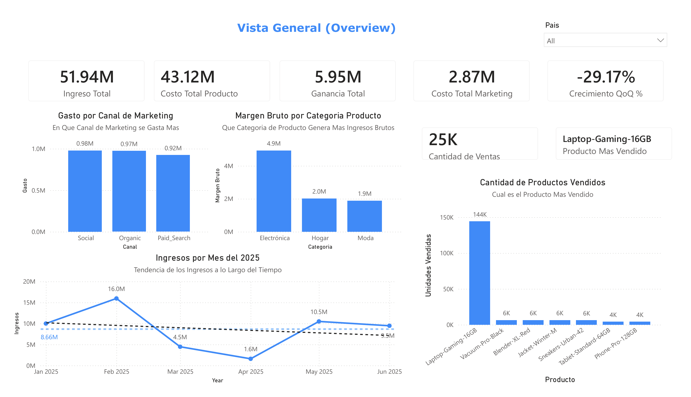
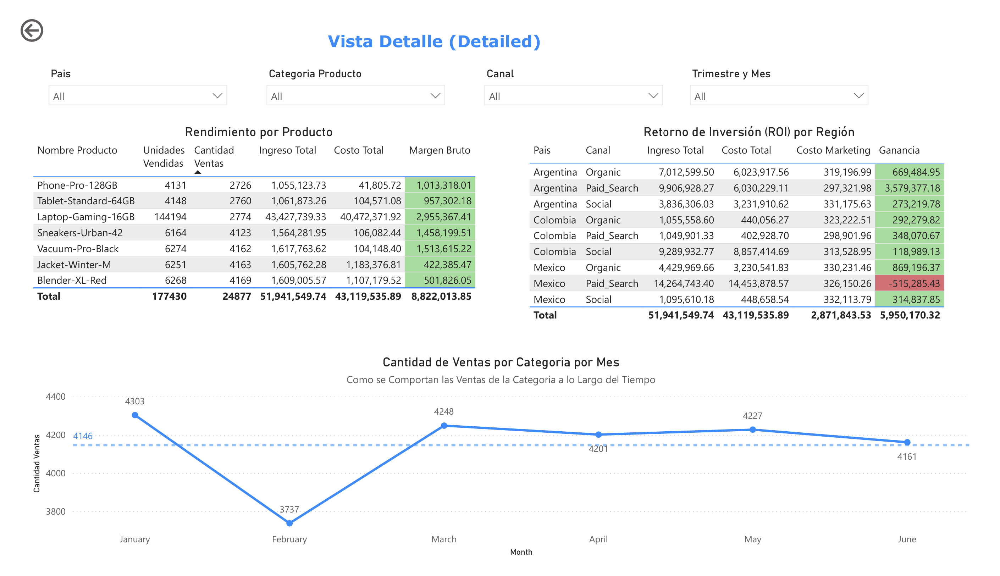
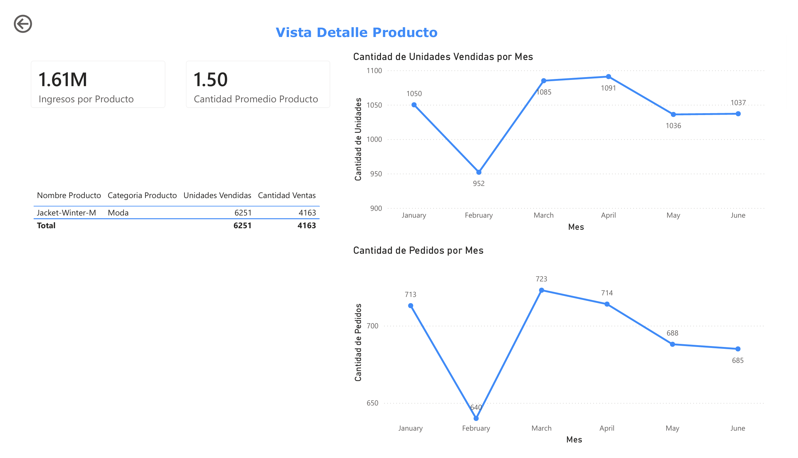

# 🛵 Proyecto RappiPlus: de Datos a Decisiones de Negocio

Proyecto integral de análisis de datos (Python + SQL + Power BI) que evalúa el desempeño de **RappiPlus**, un servicio de suscripción dentro del ecosistema de Rappi diseñado para aumentar la frecuencia de compra y el valor generado por usuario.

## 🎓 Contexto académico

Este proyecto fue desarrollado como **Proyecto Final del Bootcamp de Data Analyst de TripleTen**, e integra todas las habilidades trabajadas a lo largo del programa: limpieza y calidad de datos, análisis de rentabilidad, SQL, embudos de conversión, retención por cohortes, pruebas A/B y visualización de datos en un dashboard ejecutivo.

---

## 🧾 Descripción general

El equipo de negocio no tiene claro si RappiPlus está cumpliendo su objetivo. Existen dudas clave:

- ¿Los usuarios realmente compran más?
- ¿El modelo está generando ganancias?
- ¿Se están perdiendo oportunidades en el proceso de compra?

Para responder estas preguntas se trabaja con datos de **pedidos, catálogo, marketing, eventos de usuario y un experimento A/B**, combinando Python, SQL y Power BI.

### 🎯 Objetivo del proyecto

A lo largo del proyecto se responden seis preguntas centrales:

1. 🔍 **¿Podemos confiar en los datos?** — calidad y limpieza de datos.
2. 💰 **¿Estamos ganando dinero?** — revenue, costos y profit.
3. 🛒 **¿Dónde se pierden los usuarios?** — funnel de conversión (SQL).
4. 🔁 **¿Los usuarios regresan?** — retención por cohortes (SQL).
5. 🧪 **¿Los cambios generan impacto?** — test estadístico A/B.
6. 📊 **¿Cómo comunicamos todo esto?** — dashboard ejecutivo en Power BI.

---

## 🧹 Paso 1 — Calidad y limpieza de datos

**Hallazgos de calidad detectados:**
- `orders`: valores nulos en `pais` (300), `dispositivo` (20), `fuente_referencia` (30), `nombre_producto` (30), `categoria_producto` (80), y en las columnas numéricas `cantidad`, `precio_unitario`, `monto_descuento` (50 cada una).
- `orders`: **100 pedidos duplicados** (`id_pedido` repetido) — eliminados.
- `orders`: inconsistencias de formato en `pais` (ej. "Mexico" vs. "mexico") — estandarizadas con `.str.strip().str.title()`.
- `orders`: **4 valores negativos** en `cantidad`/`monto_total` — tratados como error y eliminados.
- `orders`: outlier extremo detectado en `cantidad` (máximo de 20,000 unidades) y `monto_total` (máximo de $8.84M) antes de la limpieza — corregido al filtrar negativos y nulos.
- `marketing`: **1,611 registros "duplicados"** en `id_campaña` (esperado, ya que la campaña se repite por fecha) y **101 valores nulos** en `canal`, imputados a partir del prefijo de `id_campaña` (ej. `Paid_Search_Mexico` → `Paid_Search`).
- `catalog`: sin problemas de calidad — no requirió limpieza.
- Conversión de `fecha_hora_pedido` y `fecha` a formato `datetime64`.

**Resultado final (datasets exportados):**

| Dataset limpio | Filas | Columnas |
|---|---|---|
| `orders_clean.csv` | 24,877 | 12 |
| `catalog_clean.csv` | 7 | 4 |
| `marketing_clean.csv` | 1,620 | 5 |

---

## 💰 Paso 2 — Rentabilidad del negocio

| KPI | Valor |
|---|---|
| Ingreso total (revenue) | **$51,941,549.74** |
| Costo total (COGS) | **$43,119,535.89** |
| Costo total de marketing | **$2,871,843.53** |
| **Profit** | **$5,950,170.32** |
| Ticket promedio por orden | **$2,087.93** |
| Cantidad promedio de productos por orden | **7.13** |
| Producto más vendido (unidades) | **Laptop-Gaming-16GB** (144,194 unidades) |

**Gasto en marketing por canal:**
| Canal | Gasto total |
|---|---|
| Social | $976,818.37 |
| Organic | $972,650.96 |
| Paid Search | $922,374.20 |

**Lectura de negocio:** el negocio **sí es rentable** (profit positivo de ~$6M), pero el margen es ajustado frente al revenue total (~11.5%), y el costo del producto (`Laptop-Gaming-16GB`) concentra la mayor parte del costo total ($40.5M de $43.1M), por lo que su rentabilidad marginal merece revisión.

---

## 🛒 Paso 3 — Funnel de conversión (SQL)

Análisis del comportamiento de usuario en la plataforma, consultando la tabla `events` vía SQL (PostgreSQL).

| Etapa del funnel | Usuarios únicos | Drop-off vs. etapa anterior |
|---|---|---|
| `first_visit` | 7,796 | — |
| `select_item` | 7,582 | 2.74% |
| `add_to_cart` | 7,634 | −0.69% (leve recuperación) |
| `begin_checkout` | 7,208 | 5.58% |
| `add_payment_info` | 6,250 | **13.29%** |

**Lectura de negocio:** la mayor pérdida de usuarios ocurre entre `begin_checkout` y `add_payment_info` (13.29% de abandono) — el momento de ingresar datos de pago es el mayor punto de fricción del embudo, más que la exploración inicial del catálogo.

---

## 🔁 Paso 4 — Retención por cohortes (SQL)

Cohortes semanales según `fecha_registro`, midiendo el % de usuarios activos en las semanas 1, 2 y 3 posteriores al registro (tabla `user_activity`).

| Cohorte (semana) | Clientes iniciales | Semana 1 | Semana 2 | Semana 3 |
|---|---|---|---|---|
| 2024-12-30 | 236 | 41.95% | 38.56% | 40.25% |
| 2025-01-06 | 351 | 41.31% | 44.73% | 42.17% |
| 2025-01-13 | 362 | 43.65% | 38.12% | 41.99% |
| 2025-01-20 | 394 | 44.16% | 39.59% | 39.85% |
| 2025-01-27 | 373 | 41.55% | 47.45% | 39.95% |

**Lectura de negocio:** la retención se mantiene relativamente estable alrededor del **40–45%** en las primeras 3 semanas, sin una caída pronunciada tipo "acantilado" — lo que sugiere que los usuarios que se mantienen tras la primera semana tienden a seguir activos, aunque cerca del 55-60% de cada cohorte se pierde ya en la primera semana.

---

## 🧪 Paso 5 — Test estadístico: experimento A/B en checkout

**Hipótesis:**
- **H₀:** no hay diferencia en la conversión entre el grupo de tratamiento y el grupo de control.
- **H₁:** sí hay diferencia en la conversión entre ambos grupos.

**Prueba aplicada:** z-test de proporciones (`proportions_ztest`), α = 0.05.

| Grupo | Conversiones | Observaciones | Tasa de conversión |
|---|---|---|---|
| Control | 779 | 4,965 | 15.69% |
| Tratamiento | 820 | 5,035 | 16.29% |

**Resultado:** z = -0.81, p ≈ 0.416 → **no se rechaza H₀**. A pesar de que el grupo de tratamiento muestra una tasa de conversión nominalmente superior (+0.6 puntos porcentuales), la diferencia **no es estadísticamente significativa**.

**Lectura de negocio:** el nuevo diseño de checkout no demuestra, con la evidencia disponible, una mejora real en la conversión. No se recomienda implementarlo de forma definitiva solo con base en este resultado — sería necesario un tamaño de muestra mayor o un rediseño más sustancial para detectar un efecto, si existe.

---

## 📊 Paso 6 — Dashboard ejecutivo (Power BI)

A partir de los tres datasets limpios (`orders_clean`, `catalog_clean`, `marketing_clean`), se construyó un dashboard de **3 páginas**:

### 1️⃣ Dashboard (Overview)
- **Tarjetas KPI:** Ingreso Total, Costo Total, Profit, Costo Marketing, Crecimiento QoQ %, Cantidad de Ventas, Producto Más Vendido.
- **Gráfico de líneas** — "Ingresos por Mes del 2025" (evolución temporal del revenue).
- **Gráfico de columnas** — "Cantidad de Productos Vendidos" por producto (con tooltip de % de unidades vendidas).
- **Gráfico de columnas agrupadas** — "Gasto por Canal de Marketing".
- **Gráfico de columnas agrupadas** — "Margen Bruto por Categoría de Producto".
- **Segmentador** de país.

### 2️⃣ Detalle
- **Tabla** — "Rendimiento por Producto": unidades vendidas, cantidad de ventas, ingreso total, costo total y margen bruto por producto.
- **Tabla** — "Retorno de Inversión (ROI) por Región": ingreso total, costo total, costo de marketing y profit por país y canal.
- **Gráfico de líneas** — "Cantidad de Ventas por Categoría por Mes".
- **Segmentadores:** país, categoría de producto, canal, y jerarquía de fecha (trimestre/mes).

### 3️⃣ Pedidos
- **Tarjetas KPI:** Ingreso Total, Cantidad Promedio de Productos.
- **Tabla** de pedidos por producto y categoría (unidades vendidas, cantidad de ventas).
- **Gráfico de líneas** — "Cantidad de Unidades Vendidas por Mes".
- **Gráfico de líneas** — "Cantidad de Pedidos por Mes".
- 

---

## 💡 Síntesis ejecutiva

| Pregunta de negocio | Respuesta |
|---|---|
| ¿Podemos confiar en los datos? | Sí, tras limpieza: se corrigieron duplicados, nulos, inconsistencias de formato y valores negativos en las 3 fuentes principales. |
| ¿Estamos ganando dinero? | Sí, profit positivo de ~$5.95M, aunque con margen ajustado (~11.5% sobre revenue). |
| ¿Dónde se pierden los usuarios? | Principalmente en el paso de pago (`add_payment_info`), con 13.29% de abandono — el mayor cuello de botella del funnel. |
| ¿Los usuarios regresan? | Retención estable en ~40-45% durante las primeras 3 semanas tras el registro. |
| ¿Los cambios generan impacto? | El nuevo checkout no mostró una mejora estadísticamente significativa en conversión (p ≈ 0.42). |
| ¿Cómo comunicamos todo esto? | A través de un dashboard ejecutivo de 3 páginas en Power BI (Overview, Detalle, Pedidos). |

---

## 🛠️ Herramientas y librerías utilizadas

- **Python** — `pandas`, `numpy`, `matplotlib`, `seaborn`
- **SQL (PostgreSQL)** — consultas con CTEs para funnel de conversión y retención por cohortes, vía `sqlalchemy`
- **scipy / statsmodels** — `proportions_ztest` para el experimento A/B
- **Power BI Desktop** — modelo de datos y dashboard ejecutivo de 3 páginas

---

## 📁 Archivos del repositorio

| Archivo | Descripción |
|---|---|
| `S12_Estudiante_Proyecto_Final.ipynb` | Notebook con el análisis completo: limpieza de datos, rentabilidad, funnel SQL, cohortes SQL y test A/B. |
| `orders_clean.csv` | Dataset de pedidos, limpio y listo para análisis/BI. |
| `catalog_clean.csv` | Catálogo de productos limpio. |
| `marketing_clean.csv` | Datos de inversión en marketing limpios. |
| `proyecto_final.pbix` | Dashboard ejecutivo en Power BI (3 páginas: Dashboard, Detalle, Pedidos). |

---

## 👤 Autor

Jesús — Data Analyst Junior
